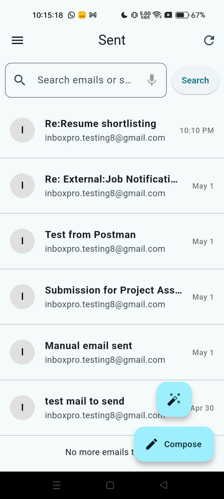
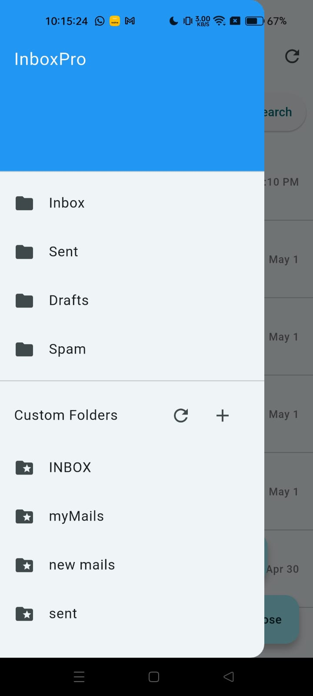

# AI Email Assistant Backend

---

## 📽️ Project Demo

[Watch the demo video on Google Drive](https://drive.google.com/file/d/19woPUuQqYcCs3xAMSEkY3KOMH_Dqy49X/view?usp=drive_link)

### App Screenshots






---

## Overview

AI Email Assistant Backend is a Node.js/Express backend for an AI-powered email assistant. It can read, analyze, search, and respond to emails using local LLM (Large Language Model) capabilities, with support for natural language and voice commands.

---

## Features

- 📧 Gmail integration (OAuth2, IMAP, SMTP)
- 🔒 Secure Google authentication
- 💾 Local SQLite storage
- 🔄 Background processing (Bull + Redis)
- 🧠 Local LLM/AI-powered:
  - Email response generation
  - Style analysis & adaptation
  - Voice-instructed replies
  - Natural language/voice search
- 🌐 RESTful API endpoints
- 🗣️ Multilingual support for instructions

---

## Architecture Overview

- **Node.js + Express**: REST API server
- **IMAP/SMTP**: Email fetching/sending
- **Google OAuth2**: Secure authentication
- **SQLite**: Local data storage
- **Bull + Redis**: Background job queue
- **Local LLM (LLaMA 3.1) or HuggingFace**: AI/ML for email response, style, and search
- **Modular Services**: For email, AI, style, translation, and voice

See [docs/ARCHITECTURE.md](docs/ARCHITECTURE.md) for a detailed diagram and explanation.

---

## Getting Started

### Prerequisites

- Node.js 18+
- Redis server
- (Optional) Local LLM (LLaMA 3.2) for full AI features

### Installation

1. **Clone the repository**
   ```bash
   git clone https://github.com/yourusername/email-ai-backend.git
   cd email-ai-backend
   ```

````
2. **Install dependencies**
   ```bash
npm install
````

3. **Configure environment variables**
   - Copy `.env.example` (if available) or create `.env`:
   ```
   PORT=5000
   GOOGLE_CLIENT_ID=your_google_client_id
   GOOGLE_CLIENT_SECRET=your_google_client_secret
   CALLBACK_URL=http://localhost:5000/auth/google/callback
   SESSION_SECRET=your_session_secret
   REDIS_HOST=localhost
   REDIS_PORT=6379
   ```

# AI/LLM

HUGGINGFACE_API_KEY=your-huggingface-api-key
LLAMA_API_URL=http://localhost:8080/completion
LOCAL_LLM_ENABLED=true

````
4. **Set up Google OAuth** ([see detailed guide](docs/SETUP_GUIDE.md))
5. **(Optional) Set up Local LLaMA** ([see detailed guide](docs/SETUP_GUIDE.md))

---

## Running the Application

- **Development:**
  ```bash
  npm run dev
````

- **Production:**
  ```bash
  npm start
  ```

---

## API Overview

- **Authentication:** `/auth/*`
- **Email Operations:** `/email/*`
- **AI/LLM:** `/ai/*`
- **Voice Search:** `/email/voice-search`

See detailed API docs:

- [AI Email API Guide](docs/AI_EMAIL_API_GUIDE.md)
- [Voice Search API Guide](docs/VOICE_SEARCH_API_GUIDE.md)
- [Compose Email API](docs/compose-email-api.md)
- [Voice Reply API](docs/voice-reply-api.md)

---

## Testing the API

- Use [Postman examples](POSTMAN_TESTING.md, POSTMAN_VOICE_SEARCH_EXAMPLES.md) for quick testing.
- Example: Voice search
  ```bash
  curl -X POST http://localhost:5000/email/voice-search \
    -H "Content-Type: application/json" \
    -d '{"voiceText": "show me emails from John about project update received last week"}'
  ```
- For local testing scripts, see `src/test-*.js` files.

---

## Contributing

Contributions are welcome! Please open issues or pull requests for improvements or bug fixes.

---

## License

This project is licensed under the ISC License.

---

## Contact

For questions, contact [your-email@example.com].
